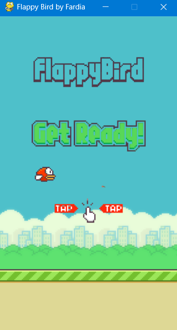
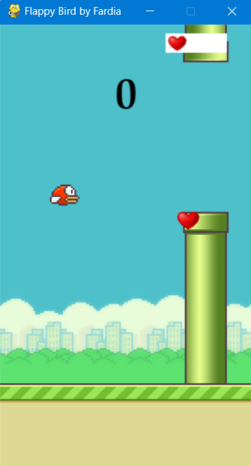
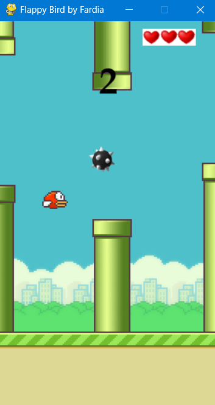

# Flappy-Bird-Game-customized-version-🐤

This is a customized version of the classic **Flappy Bird Game**, built with Python.  
The game introduces new features such as lives, collectible items, and score penalties.  

---

## ✨ Features  

- ❤️ **Lives System** – Player gets 1 live at the start.  
- 🎯 **Life Collectibles** – Extra life items appear; catching them increases remaining lives. (Max 3 lives)  
- ⚡ **Score System**  
  - If the player dies but still has lives, the score continues from the last point.  
  - Hitting an obstacle deducts points instead of ending the game immediately.  
- 🎮 **Gameplay** – Fun, challenging, and balanced for longer play.  

---

## 🖼️ Screenshots  

Here are some gameplay snapshots:  

  
  
  

